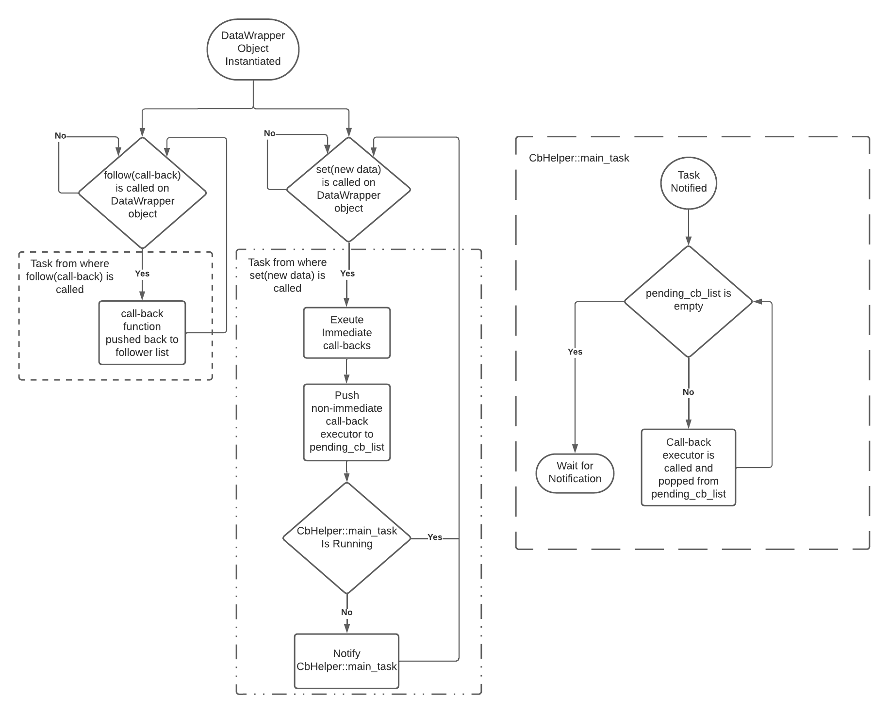

<a name="readme-top"></a>

<details>
  <summary>Table of Contents</summary>
  <ol>
    <li>
      <a href="#about">About</a>
    </li>
    <li>
      <a href="#getting-started">Getting Started</a>
      <ul>
        <li><a href="#adding-to-project">Adding to Project</a></li>
      </ul>
    </li>
    <li><a href="#usage">Usage</a></li>
    <ul>
      <li><a href="#quick-start">Quick Start</a></li>
      <ul>
        <li><a href="#instantiating-a-datawrapper-object">Instantiating a DataWrapper Object</a></li>
        <li><a href="#registering-callback-with-a-datawrapper-object">Registering Callback with a DataWrapper Object</a></li>
        <li><a href="#modifying-data">Modifying Data</a></li>
        <li><a href="#unfollowing-pausing-and-unpausing-a-callbacks">Unfollowing, Pausing, and Unpausing a Callbacks</a></li>
      </ul>
      <li><a href="#quick-example">Quick Example</a></li>
      <li><a href="#more-examples">More Examples</a></li>
    </ul>
    <li><a href="#program-flowchart">Program Flowchart</a></li>
    <li><a href="#license">License</a></li>
    <li><a href="#contact">Contact</a></li>
  </ol>
</details>

<!-- ABOUT -->
## About

DataControl is a C++ component written for esp-idf v5.0+, intended to simplify the management of data and actions associated with that data.

**What does it do?**
- Allows the creation of DataWrapper objects implemented as a template class, used to store data of any type.
- Call-back functions can be registered to DataWrapper objects.
- Call-back functions will be executed when the data of DataWrapper object is modified. 

**Why is it useful?**

In embedded applications it's often required to take some sort of action that is associated with a piece of data.   
For example, we might want to:

- Detect the press of a button, then turn on an LED, and power on an external peripheral.
- Sample a fan's tach signal, then adjust its PWM, and write its speed to an OLED.

Firmware can become complicated due to actions like these, especially in the context of a large system where several actions
may need to be associated with a single piece of data. DataControl is intended to remedy this issue. 

In the context of the above examples, with DataControl we can:

- Store the status of the button within a DataWrapper as a member of a"Button" class, register 2 different call-backs to DataWrapper in separate classes (for ex. "LedBackend" and "ExtPeripheralBackend")
- Store the speed of the fan within a DataWrapper object as a member of a "Fan" class, register 2 different call-backs to DataWrapper in separate classes (for ex. "OledBackend" & "PWMBackend")

When the data is modified due to code within the scope of the Fan or Button class, a task will be created and execute any call-back functions registered in the "LedBackend", "ExtPeripheralBackend", "PWMBackend", and "OledBackend" implementations. Meaning, any "backend" objects will be notified of new data, without being aware of each other's existence. 

This leads to well organized firmware that is much easier to work with, especially as a system expands and grows. 

It was originally inspired by an in-house component I used at a workplace; however, this component has been re-written without using
that component as a reference.   
Its functionality shares some similarities, but the implementation is different.

## Getting Started
<p align="right">(<a href="#readme-top">back to top</a>)</p>

### Adding to Project
1. Create a "components" directory in the root workspace directory of your esp-idf project if it does not exist already.  

   In workspace directory:     
   ```sh
   mkdir components
   ```


2. Cd into the components directory and clone the DataControl repo.

   ```sh
   cd components
   git clone https://github.com/myles-parfeniuk/data_control.git
   ```
   <p align="right">(<a href="#readme-top">back to top</a>)</p>

<!-- USAGE EXAMPLES -->

## Usage
<p align="right">(<a href="#readme-top">back to top</a>)</p>

### Quick Start
This is intended to be a quick-guide, api documentation generated with doxygen can be found in the documentation directory of the master branch.  
<p align="right">(<a href="#readme-top">back to top</a>)</p>

#### Instantiating a DataWrapper Object
To instantiate a DataWrapper, instantiate one of its sub-classes. The differences are as follows:

* CallAlways will execute follower callback functions _always_
* CallDifferent will only execute follower callback functions if the current data is _different_ from the new data set()
* CallSame will only execute follower callback functions if the current data is the _same_ as the new data set()

   Example syntax:  

```cpp  
    //integer data with initial value of 0,
    //callbacks executed every time set() method is called (call always)
    DataControl::CallAlways<int16_t> number(0); 

    //bool data with initial value of false, 
    //and new data is different from current data (call different)
    DataControl::CallDifferent<bool> my_bool(false);
```

Another example using the second example from the About section:  

```cpp
  /*inside Fan class definition*/
  public:
  DataControl::CallAlways<int16_t> fan_speed(0);
```
<p align="right">(<a href="#readme-top">back to top</a>)</p>

#### Registering Callback with a DataWrapper Object
To register any desired call back functions, call the follow() method. 

   Example syntax:
```cpp
   
   number.follow(
    //lambda call-back function that executes whenever set() is called on number
    [&number](int16_t new_data)
    {
      ESP_LOGI("Current Number: %d, New Number: %d", number.get(), new_data);
    });
```

Using the same fan example, it makes for good organization to register the call-back functions within the class constructors:

```cpp
/*in main.cpp*/
Fan *fan = new Fan(/*init vals*/); //instantiate fan
PWMBackend *pwm = PWMBackend(*fan); //instantiate pwm with reference to fan
OledBackend *oled = OledBackend(*fan); //instantiate oled with reference to fan

//PWMBackend constructor in PWMBackend.cpp
PWMBackend:: PWMBackend(Fan &fan):
fan(fan) //initialize fan member as reference to fan
{
  fan->fan_speed.follow(
  [&this, &fan](int16_t new_speed){
    //set pwm according to new speed with PWMBackend method
    this->pwm_control(new_speed); 
  });

}

//OledBackend constructor in Oled.cpp
OledBackend:: OledBackend(Fan &fan):
fan(fan) //initialize fan member as reference to fan
{
  fan->fan_speed.follow(
  [&this, &fan](int16_t new_speed){
    //draw speed to OLED with OledBackend method when new fan speed reading is taken
    this->draw_speed(new_speed); 
  });

}
```
<p align="right">(<a href="#readme-top">back to top</a>)</p>

#### Modifying Data
Update the data within data wrapper object by calling the set() method, and all call-backs previously registered with the follow() method will be executed automatically.
The call-backs will be executed in the order they were registered. 

   Example syntax: 
```cpp
   number.set(number.get() + 1); //increment number by one
```

Again, same example:

```cpp
//inside a task within Fan.cpp
fan_speed.set(0);
while(1)
{
  fan_speed.set(take_tach_reading()); //set fan speed as result of new reading

  /*after set is called, pwm's callback function will execute first (it was registered first),
  * and oled's will execute second (it was registered second) */

  vTaskDelay(200/portTICK_PERIOD_MS); //delay for 200ms 
}
```
<p align="right">(<a href="#readme-top">back to top</a>)</p>

#### Unfollowing, Pausing, and Unpausing a Callbacks

If it is desired to stop executing a callback, its ID must be saved when it is registered.  

Example syntax:  

```cpp
  uint16_t follower_id = 0; //callback function ID

   follower_id = number.follow(  //registering a call-back and saving its ID
    //lambda call-back function that executes whenever set() is called on number
    [&number](int16_t new_data)
    {
      ESP_LOGI("Current Number: %d, New Number: %d", number.get(), new_data);
    });

    //temporarily pauses this callback until un_pause is called, a paused callback never executes
    number.pause(follower_id);
    //un-pauses the callback such that it executes as normal
    number.un_pause(follower_id);
    //un-registers callback permanently  
    number.unfollow(follower_id); 
```
<p align="right">(<a href="#readme-top">back to top</a>)</p>


### Quick Example
A quick example that generates some terminal output which can be seen in the gif below.

Code:
```cpp
/*main.cpp*/

//standard library includes
#include <iostream> 

//in-house component includes
#include "DataControl.hpp"

//esp-idf component includes
#include "freertos/FreeRTOS.h"
#include "freertos/task.h"
#include "esp_log.h"

extern "C" void app_main()
{
    uint16_t counter_id = 0;

    DataControl::CallAlways<int16_t> counter(0); //initialize data with value of 0
    DataControl::CallDifferent<bool> over_five(false); //initialize data with value of false
    DataControl::CallDifferent<bool> over_ten(false); //initialize data with value of false

    //register callbacks
    counter_id = counter.follow(
    [&counter](int16_t new_data){
        //print current and new counts
        ESP_LOGI("Follower0", "| Current Count: %d | New Count: %d |", counter.get(), new_data); 
    });

    over_five.follow(
    [](bool new_data){
        ESP_LOGE("Follower1", "Count is now over five.");
    });

    over_ten.follow(
    [&counter, counter_id](bool new_data){
        counter.un_follow(counter_id); //un-follow counter when count exceeds ten
        ESP_LOGE("Follower2", "Count is now over ten, counter un-followed.");
    });

    while(1){
        
        counter.set(counter.get() + 1);
        vTaskDelay(500/portTICK_PERIOD_MS); //delay for 0.5 seconds
        if(counter.get() > 5){
           over_five.set(true); //set over_five true after 5 iterations of loop
        }

        if(counter.get() > 10){
            over_ten.set(true); //set over_ten true after 10 iterations of loop
        }
    }
}
```

Terminal Output:


<p align="right">(<a href="#readme-top">back to top</a>)</p>

### More Examples
Examples are available in the DataControl directory of my esp_idf_cpp_examples repo:    

[https://github.com/myles-parfeniuk/esp_idf_cpp_examples](https://github.com/myles-parfeniuk/esp_idf_cpp_examples)

My other component ButtonDriver also utilizes DataControl:

[https://github.com/myles-parfeniuk/button_driver](https://github.com/myles-parfeniuk/button_driver)
<p align="right">(<a href="#readme-top">back to top</a>)</p>

## Program Flowchart

<p align="right">(<a href="#readme-top">back to top</a>)</p>

## License

Distributed under the MIT License. See `LICENSE.md` for more information.
<p align="right">(<a href="#readme-top">back to top</a>)</p>

## Contact

Myles Parfeniuk - myles.parfenyuk@gmail.com

Project Link: [https://github.com/myles-parfeniuk/data_control](https://github.com/myles-parfeniuk/data_control)
<p align="right">(<a href="#readme-top">back to top</a>)</p>